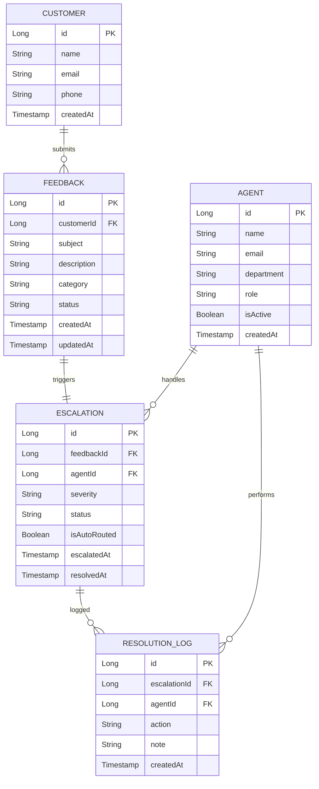

# Draft Diagrams

## 1. System Architecture Diagram

```mermaid
graph TB
    subgraph "Client Layer"
        Browser[Web Browser]
        Customer[Customer]
        Agent[Support Agent]
        Admin[Admin]
    end

    subgraph "Frontend - Hosted on Vercel/Netlify"
        FE_React[React SPA]
        subgraph "React Views"
            CustomerForm[Customer Feedback Form]
            AgentDashboard[Agent Dashboard]
            AdminReports[Admin Reports & Dashboards]
        end
    end

    subgraph "Backend - Hosted on Render/Railway"
        BE_API[Spring Boot REST API]
        subgraph "API Layer"
            FeedbackController[FeedbackController]
            EscalationController[EscalationController]
            AuthController[AuthController]
        end
        subgraph "Service Layer"
            FeedbackService[FeedbackService]
            EscalationService[EscalationService]
            UserService[UserService]
            NotificationService[NotificationService]
        end
        subgraph "Repository Layer"
            FeedbackRepository[FeedbackRepository]
            AgentRepository[AgentRepository]
            CustomerRepository[CustomerRepository]
            ResolutionLogRepository[ResolutionLogRepository]
            EscalationRepository[EscalationRepository]
        end
    end

    subgraph "Data Layer"
        DB[(PostgreSQL / MySQL)]
    end

    subgraph "External Services"
        EmailSMS[Email / SMS Gateway]
    end

    Customer -->|Submits feedback| Browser
    Agent -->|Views dashboard| Browser
    Admin -->|Views reports| Browser

    Browser -->|HTTPS Requests| FE_React
    FE_React --> CustomerForm
    FE_React --> AgentDashboard
    FE_React --> AdminReports

    FE_React <-->|REST API (JSON)| BE_API

    BE_API --> FeedbackController
    BE_API --> EscalationController
    BE_API --> AuthController

    FeedbackController --> FeedbackService
    EscalationController --> EscalationService
    AuthController --> UserService

    FeedbackService --> FeedbackRepository
    EscalationService --> EscalationRepository
    EscalationService --> AgentRepository
    NotificationService --> EmailSMS
    UserService --> CustomerRepository

    FeedbackRepository --> DB
    AgentRepository --> DB
    CustomerRepository --> DB
    ResolutionLogRepository --> DB
    EscalationRepository --> DB

    NotificationService --> EmailSMS
    EmailSMS -.->|Sends notifications| Browser
```

## 2. ER Diagram



## 3. Class/Module Diagram (Java Spring Boot Track)

```mermaid
classDiagram
    class AuthController {
        +registerCustomer(CustomerDTO) ResponseEntity
        +login(LoginRequest) ResponseEntity
        +getAllAgents() ResponseEntity<List<Agent>>
        +createAgent(AgentDTO) ResponseEntity
    }

    class FeedbackController {
        +submitFeedback(FeedbackDTO) ResponseEntity
        +getCustomerFeedback(Long customerId) ResponseEntity
        +getAllFeedback() ResponseEntity
        +getFeedbackById(Long id) ResponseEntity
    }

    class EscalationController {
        +getEscalations() ResponseEntity<List<Escalation>>
        +getEscalationById(Long id) ResponseEntity
        +assignAgent(Long escalationId, Long agentId) ResponseEntity
        +getAgentEscalations(Long agentId) ResponseEntity
    }

    class FeedbackService {
        +createFeedback(FeedbackDTO) Feedback
        +getFeedbackByCustomer(Long customerId) List<Feedback>
        +getAllFeedback() List<Feedback>
        +getFeedbackById(Long id) Feedback
        +updateStatus(Long feedbackId, String status) Feedback
    }

    class EscalationService {
        +createEscalation(Feedback feedback) Escalation
        +autoRoute(Escalation escalation) Escalation
        +assignAgent(Long escalationId, Long agentId) Escalation
        +getAllEscalations() List<Escalation>
        +getByAgent(Long agentId) List<Escalation>
        +updateStatus(Long id, String status) Escalation
        +resolveEscalation(Long id, ResolutionLogDTO log) Escalation
    }

    class UserService {
        +registerCustomer(CustomerDTO) Customer
        +createAgent(AgentDTO) Agent
        +getAllAgents() List<Agent>
        +getAgentById(Long id) Agent
        +updateAgentStatus(Long id, boolean isActive) Agent
    }

    class NotificationService {
        +sendEscalationNotification(Escalation escalation) void
        +sendResolutionNotification(Feedback feedback) void
    }

    class FeedbackRepository {
        +findByCustomerId(Long customerId) List<Feedback>
        +findById(Long id) Optional<Feedback>
        +findAll() List<Feedback>
        +save(Feedback feedback) Feedback
    }

    class EscalationRepository {
        +findByAgentId(Long agentId) List<Escalation>
        +findByStatus(String status) List<Escalation>
        +findById(Long id) Optional<Escalation>
        +save(Escalation escalation) Escalation
    }

    class AgentRepository {
        +findByDepartment(String department) List<Agent>
        +findByIsActiveTrue() List<Agent>
        +findById(Long id) Optional<Agent>
        +save(Agent agent) Agent
    }

    class CustomerRepository {
        +findByEmail(String email) Optional<Customer>
        +findById(Long id) Optional<Customer>
        +save(Customer customer) Customer
    }

    class ResolutionLogRepository {
        +findByEscalationId(Long escalationId) List<ResolutionLog>
        +save(ResolutionLog log) ResolutionLog
    }

    class Customer {
        -Long id
        -String name
        -String email
        -String phone
        -Timestamp createdAt
        +toDTO() CustomerDTO
    }

    class Feedback {
        -Long id
        -Long customerId
        -String subject
        -String description
        -FeedbackCategory category
        -FeedbackStatus status
        -Timestamp createdAt
        -Timestamp updatedAt
        +toDTO() FeedbackDTO
    }

    class Escalation {
        -Long id
        -Long feedbackId
        -Long agentId
        -SeverityLevel severity
        -EscalationStatus status
        -boolean isAutoRouted
        -Timestamp escalatedAt
        -Timestamp resolvedAt
        +toDTO() EscalationDTO
    }

    class ResolutionLog {
        -Long id
        -Long escalationId
        -Long agentId
        -String action
        -String note
        -Timestamp createdAt
        +toDTO() ResolutionLogDTO
    }

    class Agent {
        -Long id
        -String name
        -String email
        -String department
        -String role
        -boolean isActive
        -Timestamp createdAt
        +toDTO() AgentDTO
    }

    AuthController --> UserService
    FeedbackController --> FeedbackService
    EscalationController --> EscalationService
    FeedbackController --> NotificationService

    FeedbackService --> FeedbackRepository
    FeedbackService --> CustomerRepository

    EscalationService --> EscalationRepository
    EscalationService --> AgentRepository
    EscalationService --> ResolutionLogRepository
    EscalationService --> NotificationService

    UserService --> CustomerRepository
    UserService --> AgentRepository

    FeedbackService ..> Feedback : manages
    EscalationService ..> Escalation : manages
    EscalationService ..> ResolutionLog : creates
    UserService ..> Agent : manages
    UserService ..> Customer : manages

    FeedbackRepository ..> Feedback : persists
    EscalationRepository ..> Escalation : persists
    ResolutionLogRepository ..> ResolutionLog : persists
    AgentRepository ..> Agent : persists
    CustomerRepository ..> Customer : persists
```


